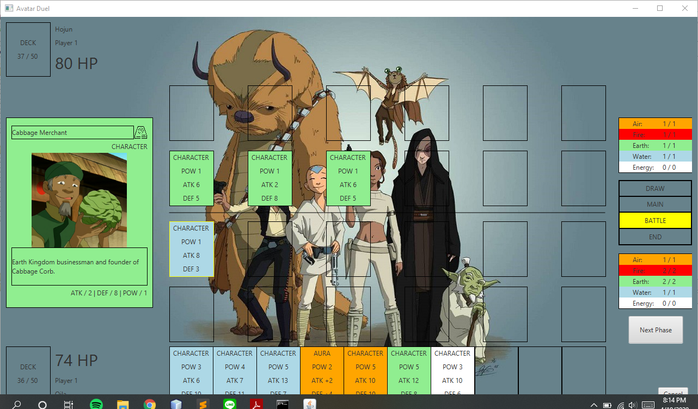

# AvatarDuel
Avatar Duel game assignment made in Java for ITB IF2210 Object Oriented Programming Course

## Created by
1.	13518007 / Ade Surya Handika
2.	13518013 / Raras Pradnya Pramudita
3.	13518016 / Indra Febrio Nugroho
4.	13518043 / Brandon Oktavian Pardede
5.	13516115 / Muhammad Naufal Fakhrizal

## Using Gradle to build program

### Prerequisites
* You have already installed JDK 8 in your local computer

You can build this program easily by opening this project in IDE such as NetBeans IDE or IntelliJ iDEA, or
run these commands in your terminal:

`./gradlew run`

It will open a game main window that displays 'Avatar Duel'.
It will start the main function in this app which is `AvatarDuel.java`.
Anyway, enjoy our game!

## Code Structure
Our program consists of 5 source packages. They are card, controller, player, util, and the main program itself. Below are the definition of each package.

### Card
Card package consists of 11 different classes. They are Aura, Card, CardBuilder, CardType, Character, Destroy, Element, Land, Position, PowerUp, and State.
* Aura, Character, Destroy, Land, and PowerUp are one of CardType.
* CardBuilder is used to create Card.
* Element is used to define card's element which is Air, Fire, Water, Earth, or Energy.
* Position is used to define card's position, which is attack or defense.
* State is used to define card's condition, whether it has an effect from attached skill or not.
Card plays a necessary role in this program, as the program itself is a card-based playing game.
Card package mainly have interaction with Player and Controller, as Card is one of Player's attribute and is needed to be displayed in the GUI.

### Controller
Controller package consists of 5 different classes. They are MainWindowController, Player1FieldController, Player2FieldController, PlayerFieldController, and SingleCardController.
* MainWindowController is used to control all 4 other controllers. It acts like an "adapter" that connects each others.
* PlayerFieldController is used to control player's behavior displayed in game. Draw card from deck, put card from hand, attack enemy, etc are parts of its job.
* Player1FieldController and Player2FieldController are the extensions of PlayerFieldController.
* SingleCardController is used to control big card details displayed in left side of the game
Controller mainly have interaction with Player, Card, and Util (CSVReader).

### Player
Player package consists of 2 different classes. They are Player and Status.
* Player is used to control player's behavior 'behind' the program. It controlls card movement, player's health point, and player's power status.
* Status is used to control player's power to summon a card from hand

### Util
Util consists of CSVReader class. It is used to read CSV, files where all cards description are stored, to be used in the game.

### Main
The main itself is used to load the Main Window fxml file which is connected to the Main Window Controller to run the program.

## Application Screenshot
1. Player 1 draws 7 cards from deck and draws another one from deck.

2. Player 1 draws a fire land card in the main phase.  Player's fire power status is now increased by one point.

3. Player 2 draws an earth land card and summons an earth character card. These are done in the main phase.

4. Player 2 attacks player 1 using shown card. Player 1's HP is now substracted by the attacking card's attack point as there is no card on the player 1's field.

5. Player 1 is gonna attack player 2 using Hahn (the highlighted blue card) with 8 attack points. The target is player 2's cabbage merchant with 2 attack points.

The recent target is now removed from the field, and player 2's HP is substracted by (8-2) = 6 points.

**Curious to know more? Let's try it yourself and join the fun!**

## Credits

All images and description are taken from [Avatar Wikia](https://avatar.fandom.com/wiki/Avatar_Wiki)

[Ka Yonas' Project Template](https://gitlab.informatika.org/labpro/if2210-avatar-duel-project-template/)

We used image for our game background from [here](https://vistapointe.net/avatar-the-last-airbender.html)